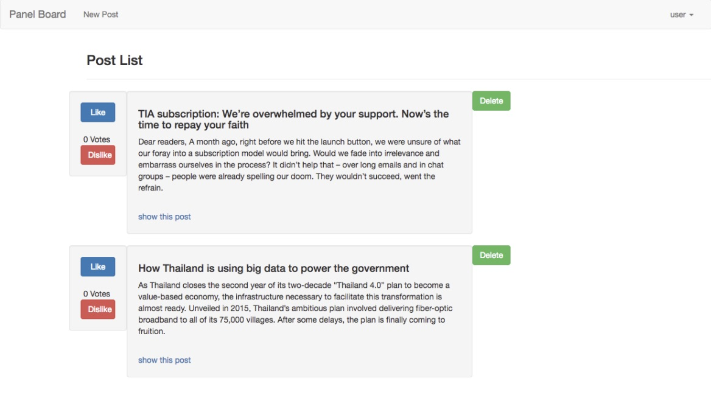

# rails-post-board

<h3>Description</h3>
  post board

<h3>Image</h3>
  <p align="center" >
      
  </p>

<h3>Enviroment</h3>
  rails ~> 5.2.1
  ruby ~> 2.4.0
  jquery-rails (4.3.3)
  bootstrap-sass (3.3.7)


<h3>Execute and Run</h3> 

``` bash
# path
cd vuex-rails-shopping-cart

# excute server
rails s

# local test
localhost:3000
```

<h3>Heroku Demo</h3>
<a href="https://infinite-reef-53475.herokuapp.com/
" target="_blank">demo</a>


